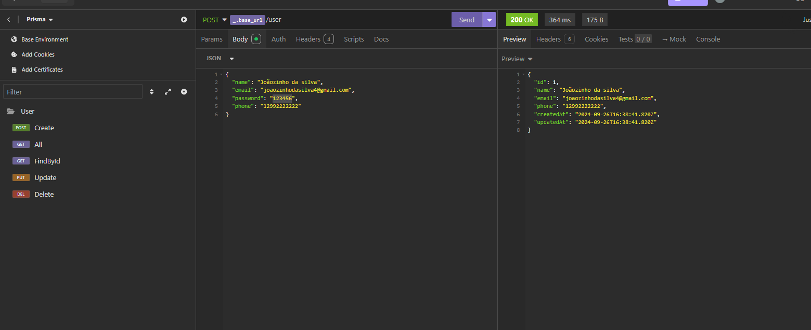
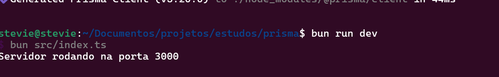

# **Projeto Prisma**

## Dependencias para uso

- Docker
- Bun ( Opcional recomendado ) ou npm ou yarn

## Instalações

- Clone o projeto
- Entre no diretório raiz do projeto `cd prisma`
- Copie o .env.example para .env
- instale as dependencias: - bun: `bun install` - npm: `npm install` - yarn: `yarn install`
- Rode o comando do docker para build `docker compose build`
- Apos isso rode o comando do docker para subir os serviços `docker compose up -d`
- Rode o comando para iniciar as migrações ao banco de dados: `npx prisma migrate dev --name init`
- Inicie o servidor do express com o comando: - bun: `bun run dev` - npm: `npm run tsc` - yarn: `yarn run tsc`

Atualmente o package.json esta configurado no script de dev para rodar com bun como principal, 
  pois evita ter que passar o projeto todo para javascript para poder execuar, 
  caso prefiram usem os comandos mencionados acima para npm e yarn que gerara um arquivo dist/ com todo o projeto 
  e ficará ouvindo as modificações no projeto em tempo real.

- Após uniciar o projeto utilize o arquivo de insomnia na raiz do projeto para lançar suas requisições ao servidor e aproveite

## Possiveis erros

- Verifique se executou todos os comandos mencionados acima
- Caso seja mencionado erro de migração de dados verifique se seu banco esta rodando e corretamente apontado.
- Verifique se tem permissão de escrita na pasta node_modules - [ Erro ocorrido em desenvolvimento deste projeto ]

## Demonstrações do projeto

